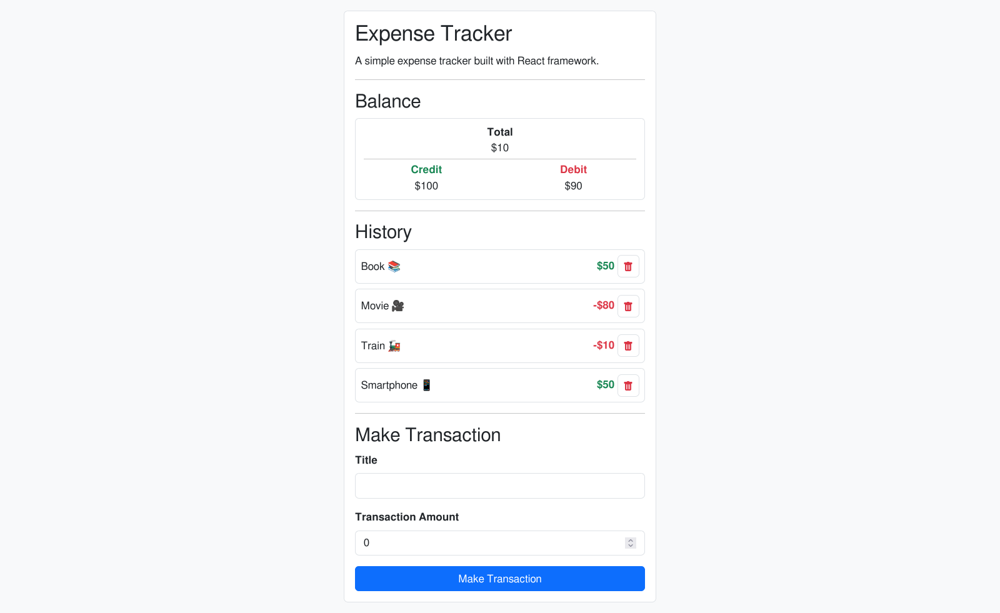

# Learning and Development: React Expense Tracker

This is a simple single page expense tracker application built with React library.

- **Author:** Sakthi Santhosh
- **Created on:** 22/01/2023

## Preview

## Issues

1. The `GlobalContext` provider is subscribed by `Balance`, `History` and `Transaction` components. There is an unnecessary re-rendering of the `Transaction` component when a `HistoryCard` component is deleted. This is due to the fact that React re-renders all the components that have been subscribed to the `GlobalContext` provider.
